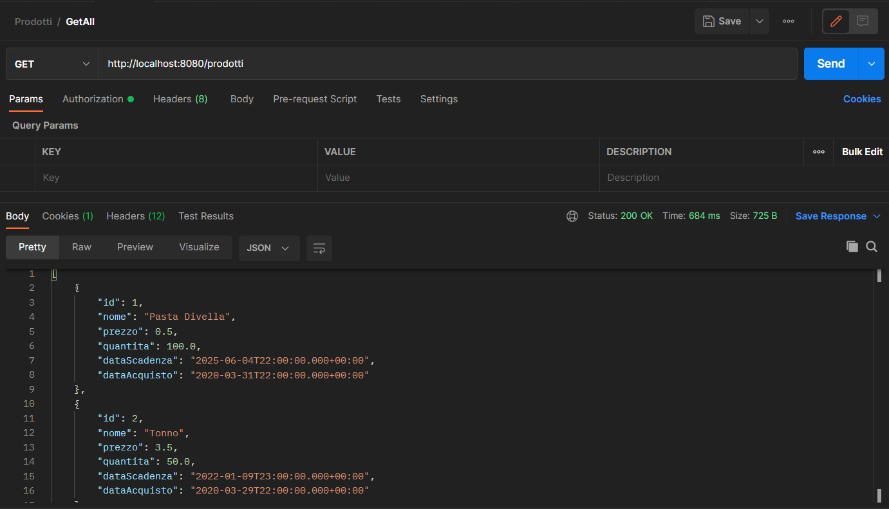
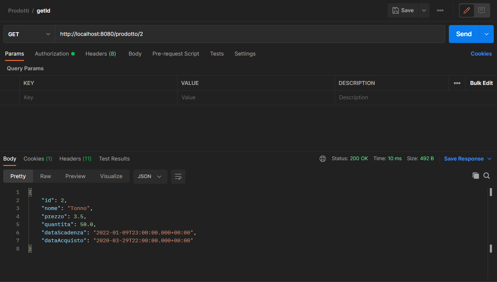
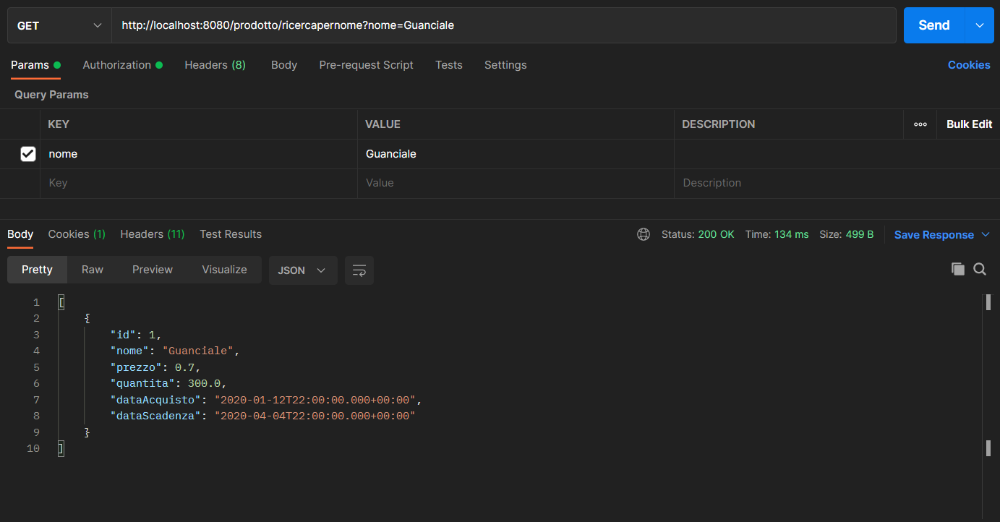
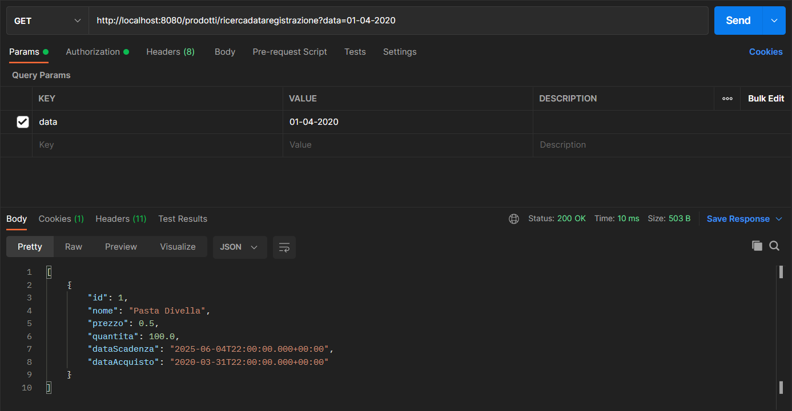
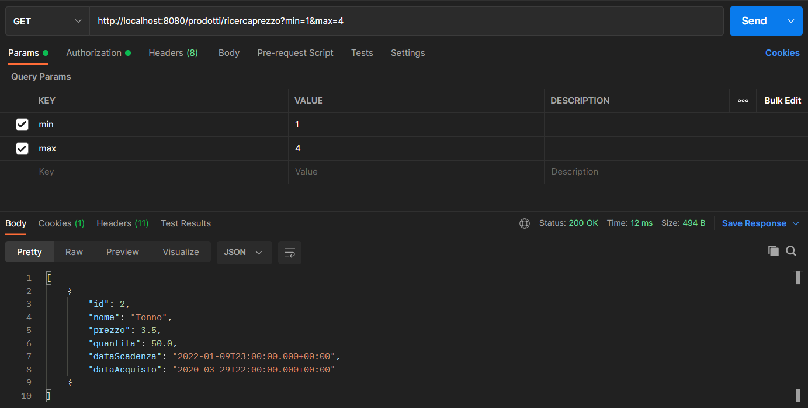
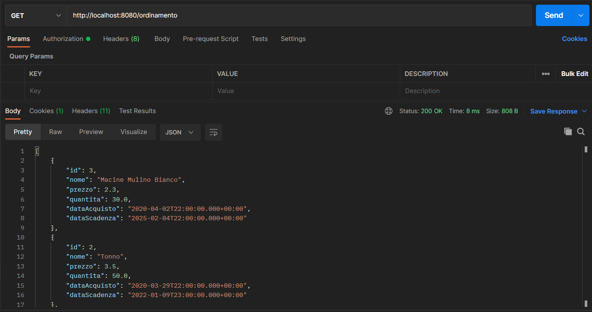
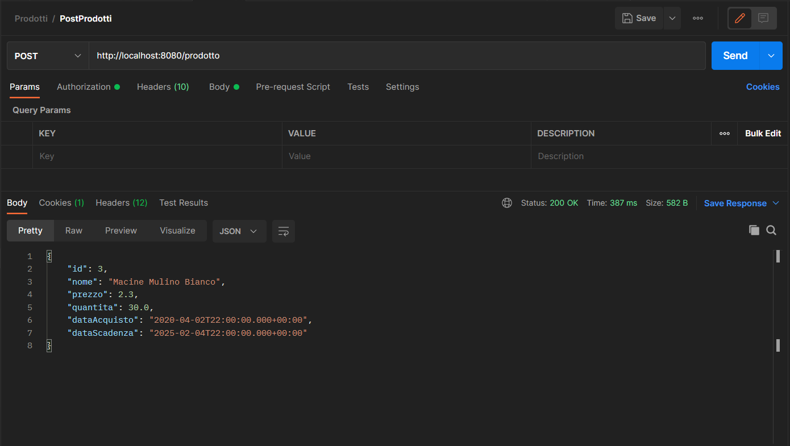
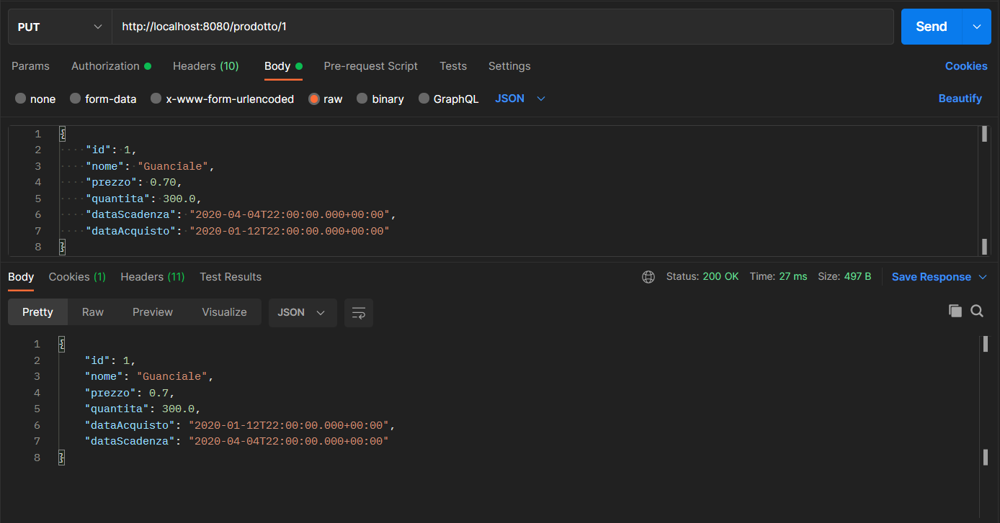
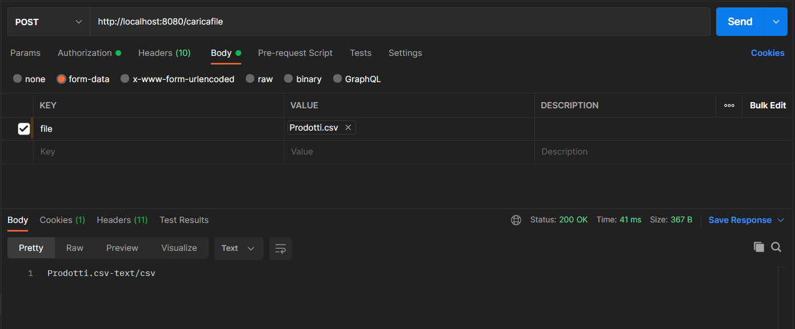
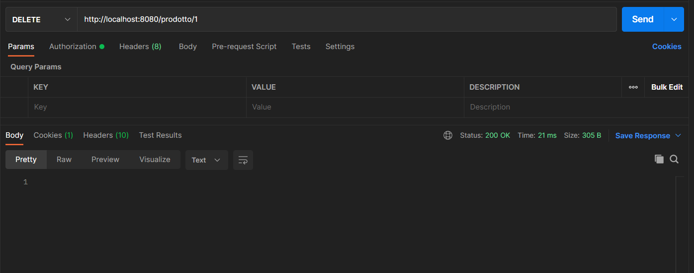

# ProdottiSpringTest

##Esercitazione fonale JEE

Test finale: Applicazione ricerca e inserimento prodotti in spring

###Repository gitHub: https://github.com/giorgioA00/ProdottiSpringTest

###GetAll

###GetId

###GetNome

###GetPerData

###GetPerPrezzo

###Ordinamento

###PostProdotti

###PutProdotti

###UploadFile

###Delete
